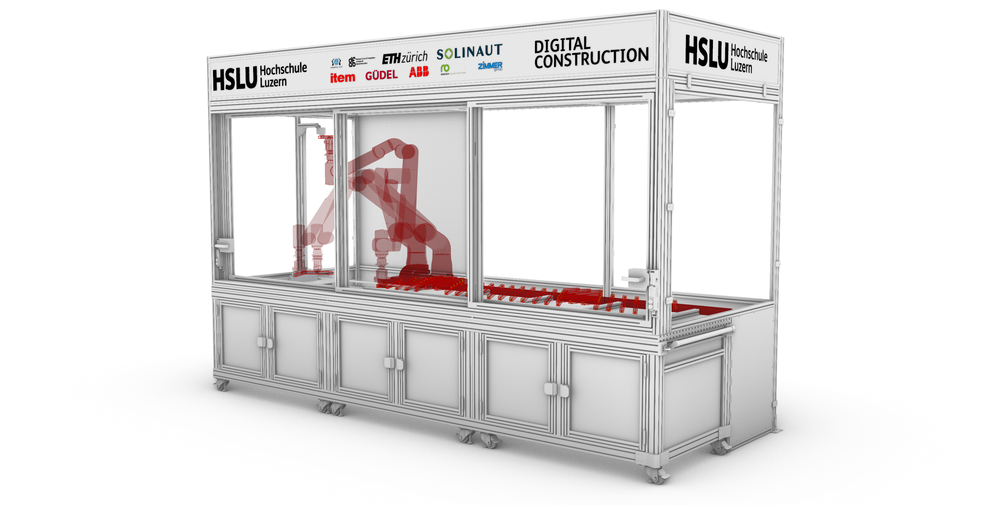
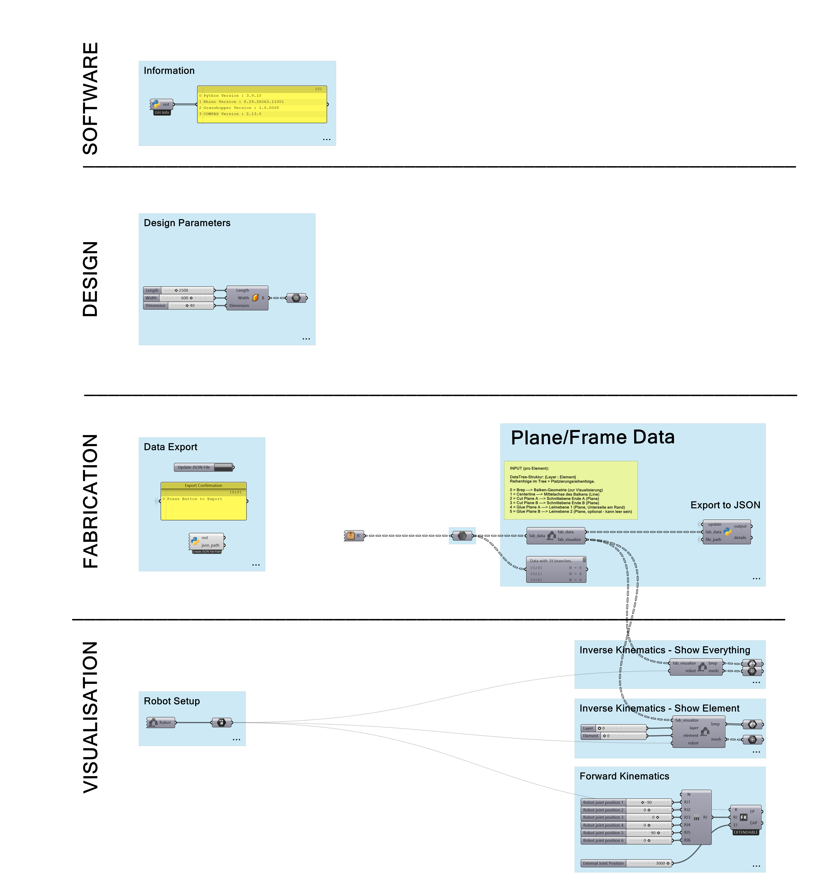

# HSLU RRC Facade - Parametrische Fassadenelemente

Robotische Produktion von parametrischen Fassadenelementen mit dem ABB Gofa CRB 15000.

> **Hinweis:** Der `process/` Ordner (Python/Roboter-Steuerung) ist aktuell noch **Work in Progress**. Der Grasshopper-Workflow und die Input-Spezifikation sind bereit.


## Übersicht

Ihr designt in Grasshopper ein parametrisches Fassadenelement aus 25x25mm Holzlatten,
das robotisch auf einen Grundrahmen (600 x 2500mm, 40x40mm) platziert wird.

**Pipeline:** Grasshopper (Design) → JSON Export → Python (Roboter-Steuerung)

**Stationen:** Pick → Cut → Glue → Place

| Station | Was passiert |
|---------|-------------|
| **Pick** | Roboter holt Holz aus dem Lager |
| **Cut** | Roboter fährt zur Säge, schneidet beide Enden (Gehrungsschnitte) |
| **Glue** | Roboter fährt zur Leimstation, Leim wird aufgetragen |
| **Place** | Roboter platziert das Holz auf dem Rahmen |

## Was ihr liefern müsst

Ihr liefert pro Element **5-6 Geometrien** als Grasshopper DataTree mit `{Layer;Element}` Struktur:

| Index | Name | Typ | Beschreibung |
|-------|------|-----|-------------|
| 0 | Brep | Brep | Fertige Balkengeometrie (25x25mm, mit Gehrung) |
| 1 | Centerline | Line | Mittelachse des fertigen Balkens |
| 2 | Cut Plane A | Plane | Schnittebene Ende A |
| 3 | Cut Plane B | Plane | Schnittebene Ende B |
| 4 | Glue Plane A | Plane | Leimebene 1 (Unterseite, am Rand) |
| 5 | Glue Plane B | Plane | Leimebene 2 (optional) |

Alles im **Weltkoordinatensystem** von Rhino (= `ob_HSLU_Place`). Origin liegt oben links am Rahmen.

Die detaillierte Spezifikation mit Bildern findet ihr unter **[`STUDENT_INPUT.md`](STUDENT_INPUT.md)**.



Folgendes wird automatisch berechnet:
- **beam_size** (aus Centerline-Länge)
- **place_position** (aus Centerline)
- **Roboter-Positionen** (Transformation in die jeweiligen Workobjects)

## Constraints / Einschränkungen

| Constraint | Wert |
|-----------|------|
| Rahmengrösse | X: 0 - 2500mm, Y: 0 - -600mm |
| Balkenquerschnitt | 25 x 25mm |
| Maximale Anzahl Layer | 2 (Layer 0 und Layer 1) |
| Schnitttyp | Nur Gehrungsschnitte (1D), keine Schifterschnitte |
| Leimebenen pro Element | 1 - 2 |
| Platzierungsreihenfolge | = Reihenfolge im DataTree |

## Workflow



### 1. Design in Grasshopper

1. Öffne das GH-Template (`grasshopper/hslu_rrc_facade.gh`)
2. Verbinde eure Geometrie mit den Inputs (siehe [`STUDENT_INPUT.md`](STUDENT_INPUT.md))
3. Prüfe visuell die Roboterdarstellung (Inverse Kinematics) - sind die Positionen erreichbar?
4. Exportiere die Daten (Button `update = True`)

### 2. JSON prüfen

Die exportierte Datei liegt unter `process/data/fab_data.json`.

Ihr könnt die Daten vorab prüfen:

```bash
cd process
python validate.py
```

### 3. Produktion starten

```bash
# 1. Docker starten (einmalig)
cd docker
docker compose up -d

# 2. Produktion starten
cd ../process
python production.py
```

### Konfiguration in `production.py`

```python
LAYER    = 0      # Welcher Layer (0 oder 1)
N_RUNS   = 1      # Wie viele Elemente produzieren
START_I  = 0      # Ab welchem Element-Index starten

DO_PICK  = True   # Stationen ein/aus (zum Testen)
DO_CUT   = True
DO_GLUE  = True
DO_PLACE = True
```

## Requirements

### Design (bei euch)

- Rhino 8
- Grasshopper (in Rhino 8 integriert)
- [Robot Components](https://github.com/RobotComponents/RobotComponents) **v4.1.0** (GH Plugin, via Package Manager installieren)

### Produktion (wird zur Verfügung gestellt)

> Der Produktions-PC/Laptop an der Anlage ist bereits vollständig eingerichtet.
> Ihr müsst diese Software **nicht** auf euren Rechnern installieren.

- Python 3.13 (Anaconda)
- [COMPAS](https://compas.dev/) v2.10
- [compas_rrc](https://github.com/compas-rrc/compas_rrc)
- [compas_fab](https://github.com/compas-rrc/compas_fab)
- Docker Desktop (ROS + ABB Driver)

## Projektstruktur

```
hslu_rrc_facade/
├── README.md                    # Diese Datei
├── STUDENT_INPUT.md             # Detaillierte Input-Spezifikation
├── docs/
│   └── images/                  # Bilder zur Dokumentation
├── docker/
│   └── docker-compose.yml       # ROS + ABB Driver
├── grasshopper/
│   ├── hslu_rrc_facade.gh       # GH Template
│   ├── export_fab_data.py       # GH Python Export-Script
│   └── validate_fab_data.py     # GH Python Validierung
├── process/                     # (Work in Progress)
│   ├── production.py            # Hauptskript
│   ├── validate.py              # Daten-Validierung
│   ├── globals.py               # Konfiguration
│   ├── data/
│   │   ├── fab_data.json        # Euer Export (aus GH)
│   │   └── wood_storage.json    # Holzlager-Inventar
│   ├── _skills/                 # Robot-Skills (NICHT verändern!)
│   └── stations/                # Station-Code (NICHT verändern!)
└── design/                      # Eure Design-Dateien
```

**Wichtig:** Dateien in `_skills/` und `stations/` bitte NICHT verändern!

## Troubleshooting

| Problem | Lösung |
|---------|--------|
| Roboter in GH zeigt unrealistische Pose | Geometrie anpassen, Position ist nicht erreichbar |
| `validate.py` zeigt Fehler | Daten in GH korrigieren und neu exportieren |
| "Nicht genug Holz" | Holzlager physisch auffüllen, Script fragt danach |
| Docker-Fehler | `docker compose down && docker compose up -d` |
| Roboter antwortet nicht | Prüfe ob Controller eingeschaltet und im AUTO-Modus |

## Kontakt

Bei Problemen: Juri - juri.jerg@hslu.ch kontaktieren.
