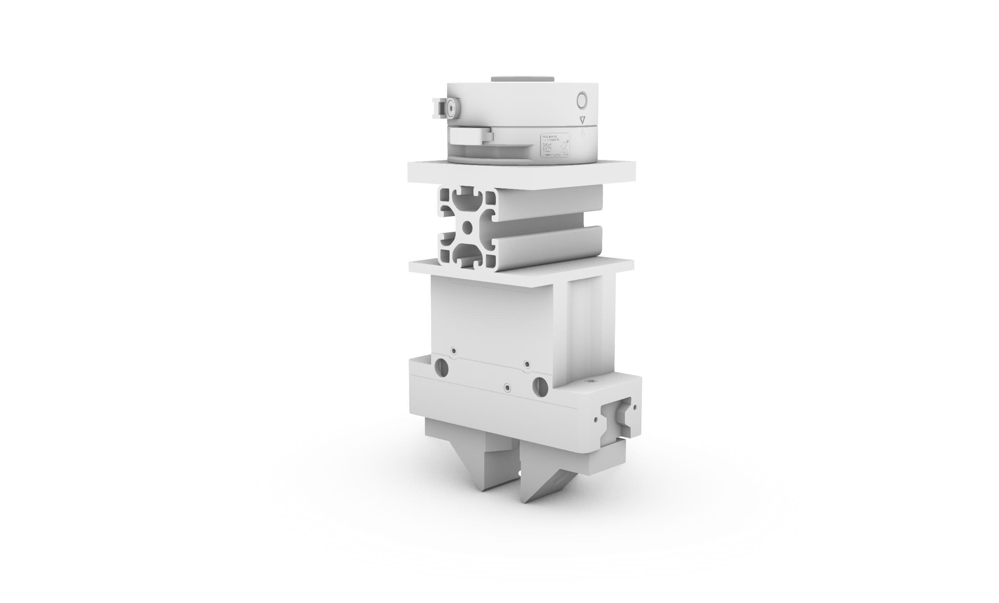

# Greifer - Zimmer GPP5010

## Übersicht

Pneumatischer Parallelgreifer, montiert am ABB Gofa CRB 15000. Greift die 25x25mm Holzstäbe mittig am Querschnitt.

## Kinematik

- **Hub pro Backe:** 10mm (5mm öffnen, 5mm schliessen)
- **Gesamthub:** 20mm
- **Mittelstellung (50%):** Backen berühren den 25mm Balken beidseitig
- **Voll geöffnet:** 35mm Öffnung (25mm + 2 × 5mm)
- **Voll geschlossen:** 25mm - 2 × 5mm = 15mm

## Rhino-Modell

Das Rhino-File zeigt den Greifer in **Mittelstellung** (50% geschlossen) - Backen liegen am 25x25mm Balken an. Von dieser Position öffnet er **5mm nach aussen** (auf) und **5mm nach innen** (zu) pro Backe.

